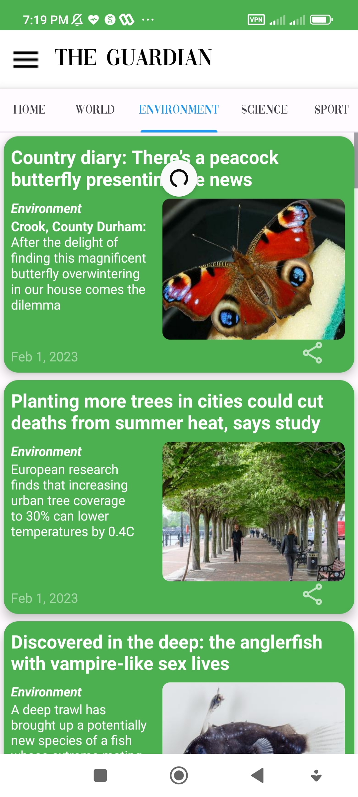
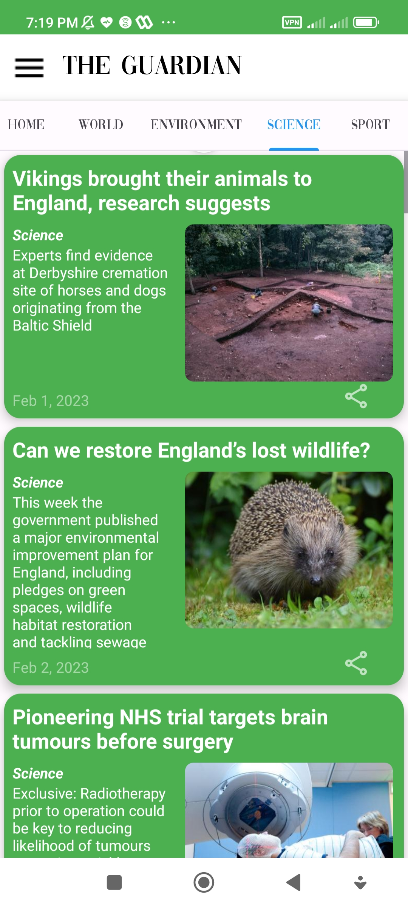
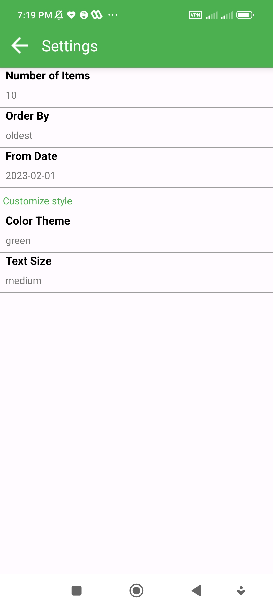
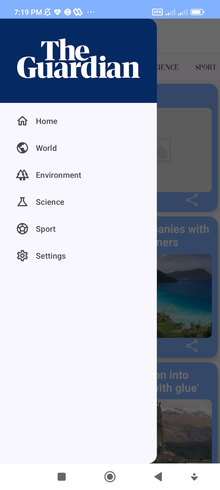
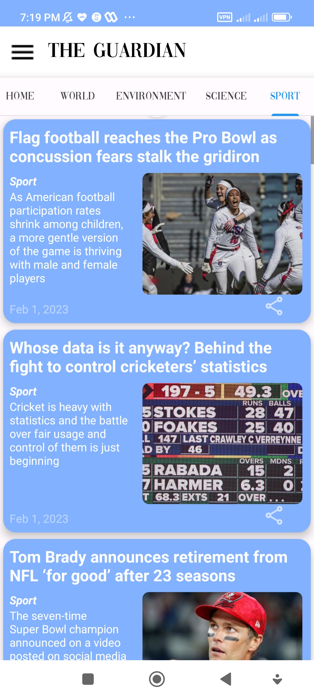

# Guardian News
## Description
This app is an android client for accessing news data from **The Guardian** using their [**Open Platform API**](https://open-platform.theguardian.com/) which is publicly available. This project alongside with [**YourMusic**](https://github.com/farbodbj/YourMusic) were the two projects I have completed as an exercise in the process of my android bootcamp.

## Stack

| Tools | Link |
| :--- | :---: |
| 🤖 Kotlin | [Kotlin](https://kotlinlang.org/) |
| 🌐 Retrofit | [Retrofit](https://square.github.io/retrofit/) |
| 🗄️ Room | [Room Persistence Library](https://developer.android.com/training/data-storage/room) |
| 📖 Paging3 | [Paging3](https://developer.android.com/topic/libraries/architecture/paging/v3-overview) |
| 🗝️ Hilt | [DI](https://dagger.dev/hilt/) |
| 🖼️ Glide | [Media Loading](https://github.com/bumptech/glide) |

## Design Process
This app was developed with regard to [Google's app architecture recommendations and best practices](https://developer.android.com/topic/architecture).
The app have used software engineering best practices and suitable design patterns/principles such as MVVM, Dependency Injection, SSOT and layered architecture to make it more maintainable and scalable.

The app has been tested for being crash-free, to provide a good UX and to have minimum runtime bugs which may or may not manifest when using the app.

## Visuals

### screenshots

<table style="width:100%">
  <tr>
    <th>main page (enivronment)</th>
    <th>main page (science)</th> 
    <th>settings</th>
    <th>navigation drawer</th>
  </tr>
  <tr>
    <td></td> 
    <td></td>
    <td></td> 
    <td></td>
  </tr>
  <tr>
    <th>main page (sky blue theme)</th>
  </tr>
  <tr>
    <td></td>
  </tr>
</table>

## Usage
This project can easily be cloned, built and tested using android studio, the only change you need to apply is putting your own api-key inside the code at [this part:](https://github.com/farbodbj/GuardianNews/blob/master/app/src/main/java/com/bale_bootcamp/guardiannews/data/network/NewsApiService.kt)

```
    const val API_KEY = "[YOUR_OWN_API_KEY]"
```
## Contributing
Feel free to contribute to this project by pointing out any bugs, design flaws, updating for best practices or etc using issues or pull requests. I hope this app can be used as a reference for other learners or even be used to actually read some news :)